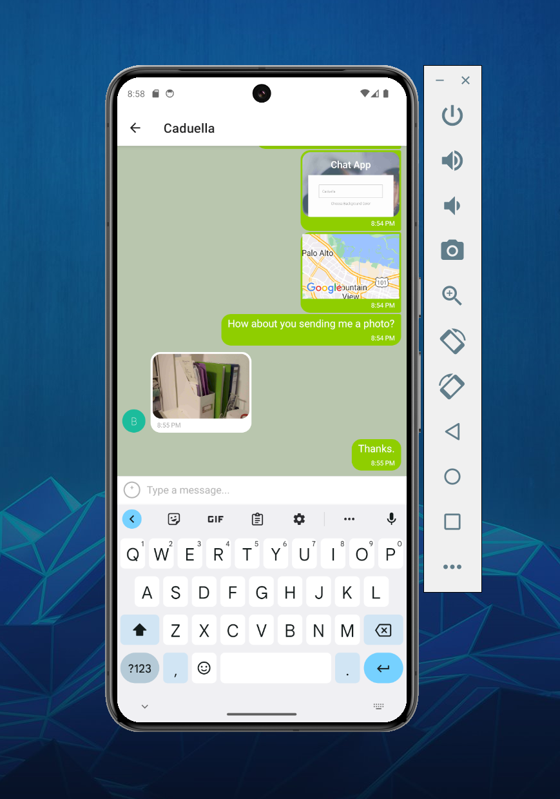

# Chat App

## Description
This is a chat app for mobile devices using React Native. The app provides users with a chat interface and options to share images and their location.

## Screenshot of the App



## Key Features
* A page where users can enter their name and choose a background color for the chat screen before joining the chat.
* A page displaying the conversation, as well as an input field and submit button.
* The chat provides users with two additional communication features: sending images and location data.
* Data gets stored online and offline.

## Technical Requirements
* The app is written in React Native.
* The app is developed using Expo.
* The app is styled according to the given screen design.
* Chat conversations is stored in Google Firestore Database.
* The app authenticates users anonymously via Google Firebase authentication.
* Chat conversations is stored locally.
* The app lets users pick and send images from the phone’s image library.
* The app lets users take pictures with the device’s camera app, and send them.
* The app stores images in Firebase Cloud Storage.
* The app is able to read the user’s location data.
* Location data is sent via the chat in a map view.
* The chat interface and functionality are created using the Gifted Chat library.
* Android Studio was utilized as an android emulator.
* The app’s codebase contains comments.

## Design Specifications
* Vertical and horizontal spacing: evenly distributed
* App title: font size 45, font weight 600, font color #FFFFFF
* “Your name”: font size 16, font weight 300, font color #757083, 50% opacity
* “Choose background color”: font size 16, font weight 300, font color #757083, 100% opacity
* Color options HEX codes: #090C08; #474056; #8A95A5; #B9C6AE
* Start chatting button: font size 16, font weight 600, font color #FFFFFF, button color #757083

## Dependencies 
* **React Native**: Framework for building mobile applications using JavaScript and React.
* **Expo**: Development platform for building React Native applications.
* **GiftedChat**: A library for creating chat interfaces in React Native applications.
* **Google Firebase**: Cloud-based platform that provides various services, including Firestore for real-time database and authentication.
* **AsyncStorage**: Local storage system in React Native for caching and persisting data.
* **Expo ImagePicker**: Expo API for accessing the device's image picker to choose images from the gallery.
* **Expo MediaLibrary**: Expo API for accessing and managing media assets on the device.
* **Expo Location**: Expo API for obtaining location information from a device.
* **react-native-maps**: React Native Map components for iOS + Android.
* **MapView**: Specific component from the react-native-maps library used to display maps in React Native applications.

## Installation

1. **Set up Expo**
   * Node.js (downgrade to 16.19.0 since Expo will only support Node 16 and lower versions)
      ```nvm install 16.19.0``` then ```nvm use 16.19.0```
   * Expo and Expo CLI to build the app   ```npm install -g expo-cli```
   * Expo Go app, in order to test the app on a physical mobile device
   * Create an Expo account

2. **Set up Android Emulator**
   * Install Android Studio (for Android development) or Xcode (for iOS development)
   * Choose an appropriate virtual device (AVD for Android devices) using Virtual Device Manager

3. **Clone the Repository**

   ```bash
   git clone https://https://github.com/Caduella/Chat-App.git
   ```

4. **Install Dependencies:**

   - ```npm install @react-native-async-storage/async-storage```: asynchronous, persistent key value storage

   - ```npm install @react-native-community/netinfo```: monitoring on/offline status

   - ```npm install @react-navigation/native```: navigation library

   - ```npm install @react-navigation/native-stack```: react-navigation dependencies

   - ```npm install expo-image-picker```: access to the device's image library

   - ```npm install expo-location```: access to the device's geolocation

   - ```npm install firebase```: real-time database and storage services

   - ```npm install react-native```: native-app development tool utilizing react

   - ```npm install react-native-gifted-chat```: Chat UI components

   - ```npm install react-native-maps```: Geolocation tool

   - ```npm install react-native-safe-area-context```: react-navigation dependencies

   - ```npm install react-native-screens```: react-navigation dependencies

4. **Configure Firebase:**

   - Create a Firebase project: [Firebase Console](https://console.firebase.google.com/)
   - Obtain your Firebase configuration (apiKey, authDomain, projectId, storageBucket, messagingSenderId, appId) and update it in `Chat.js`.

5. **Run the App:**

   ```bash
   npx expo start
   ```
   - for the android emulation on the computer, click "a" after Metro Bundler is finished
   - for the physical smartphone, scan QR code using the Expo Go app
   - Once the app is launched, you will be asked to enter the user name and choose the background color and start chatting.
   - Use the '+' button on the left of the message bar in order to access additional features such as choose images from the libray, take a picture, and send location info